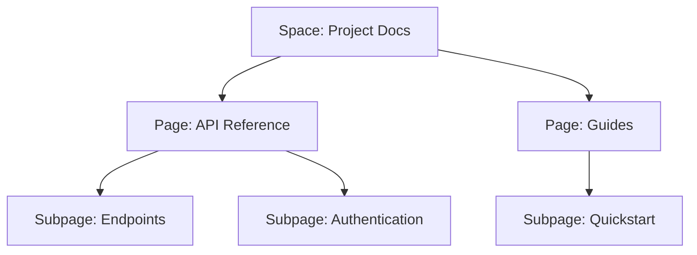

## Overview

Brooma equips you with robust tools to streamline your documentation workflow. You organize content hierarchically, collaborate seamlessly with teams, search efficiently, track changes via version control, and customize spaces to fit your needs. These features ensure your project docs stay accessible, up-to-date, and tailored.

<Callout kind="tip">
Start by creating a new space to group related documentation. This sets the foundation for all features.
</Callout>

## Key Features at a Glance

<Columns cols={3}>
  <Card title="Organization" icon="folder" href="#document-organization">
    Build intuitive hierarchies with pages and subpages.
  </Card>
  <Card title="Collaboration" icon="users" href="#collaboration">
    Edit together in real time and discuss changes.
  </Card>
  <Card title="Search & Navigation" icon="search" href="#search-navigation">
    Find content instantly across your space.
  </Card>
  <Card title="Version Control" icon="git-branch" href="#version-control">
    Track and revert changes effortlessly.
  </Card>
  <Card title="Customization" icon="settings" href="#customization">
    Personalize layouts and permissions.
  </Card>
</Columns>

## Document Organization and Structure

You structure your documentation using spaces, pages, and subpages. Create nested hierarchies to reflect your project's architecture.



<Steps>
  <Step title="Create a Space" icon="plus">
    Navigate to your dashboard and select "New Space".
  </Step>
  <Step title="Add Pages" icon="file-text">
    Inside the space, click "New Page" and name it descriptively.
  </Step>
  <Step title="Nest Subpages" icon="chevron-down">
    Drag pages under others to build the hierarchy.
  </Step>
</Steps>

## Collaboration and Editing Tools

Brooma supports real-time editing, comments, and @mentions to keep teams aligned.

<Tabs>
  <Tab title="Real-time Editing" icon="edit-3">
    Multiple users edit simultaneously. Changes appear instantly.

    <CodeGroup tabs="Markdown,Rich Text">
    ````markdown
    # Welcome to Brooma

    Edit this page collaboratively.
    ````

    ````html
    <h1>Welcome to Brooma</h1>
    <p>Edit this page collaboratively.</p>
    ````
    </CodeGroup>
  </Tab>
  <Tab title="Comments & Mentions" icon="message-circle">
    Highlight text, add comments, and @mention teammates.

    Example: `@team review this section`.
  </Tab>
</Tabs>

## Search and Navigation Functionalities

Quickly locate content with full-text search, breadcrumbs, and table of contents.

| Feature | Description | Benefit |
|---------|-------------|---------|
| Global Search | Searches titles, content, and tags | Finds anything in `<1s` |
| Breadcrumbs | Shows hierarchy path | Easy navigation back |
| Auto TOC | Generates sidebar outline | Jump to sections |

<Callout kind="info">
Use tags like `api`, `guide` for better filtering.
</Callout>

## Version Control for Docs

Track every change with history, diffs, and restore points. No Git setup required.

<CodeGroup tabs="View History,Restore Version">
  ````javascript
  // Fetch page history via API
  const history = await fetch('https://api.example.com/docs/pages/{pageId}/history');
  const versions = await history.json();
  console.log(versions);
  ````

  ````javascript
  // Restore specific version
  await fetch('https://api.example.com/docs/pages/{pageId}/restore', {
    method: 'POST',
    body: JSON.stringify({ versionId: 'v1.2' })
  });
  ````
</CodeGroup>

## Customization Options for Spaces

Tailor spaces with themes, permissions, and custom fields.

<Expandable title="Advanced Permissions" default-open="false">
  Set role-based access:

  | Role | View | Edit | Admin |
  |------|------|------|-------|
  | Viewer | ✅ | ❌ | ❌ |
  | Editor | ✅ | ✅ | ❌ |
  | Owner | ✅ | ✅ | ✅ |
</Expandable>

<ExpandableGroup>
  <Expandable title="Custom Themes">
    Apply your brand colors via settings.
  </Expandable>
  <Expandable title="Integrations">
    Connect to GitHub or Slack for notifications.
  </Expandable>
</ExpandableGroup>

## Next Steps

<Columns cols={2}>
  <Card title="Quickstart Guide" icon="rocket" href="/quickstart">
    Set up your first space.
  </Card>
  <Card title="API Reference" icon="code" href="/authentication">
    Integrate programmatically.
  </Card>
</Columns>