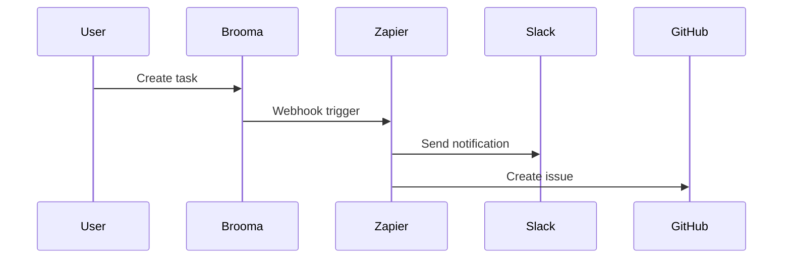

## Overview

Brooma supports seamless integrations with popular third-party services. You can connect tools like Slack, GitHub, and Zapier to automate notifications, sync data, and trigger workflows. Use the Brooma API for custom integrations, configure webhooks for real-time updates, and handle data exports or imports efficiently.

<Callout kind="tip">
Before starting, ensure you have a Brooma API key from your dashboard at `https://dashboard.example.com/settings/api`.
</Callout>

## Supported Integrations

Discover ready-to-use integrations that enhance your Brooma workflow.

<Columns cols={3}>
  <Card title="Slack" icon="message-circle" href="https://slack.com" target="_blank">
    Send task updates and alerts directly to Slack channels.
  </Card>
  <Card title="GitHub" icon="github" href="https://github.com" target="_blank">
    Sync issues, pull requests, and repositories with Brooma projects.
  </Card>
  <Card title="Zapier" icon="zap" href="https://zapier.com" target="_blank">
    Build no-code automations connecting Brooma to 5000+ apps.
  </Card>
</Columns>

## Setting up API Connections

Follow these steps to generate and use your API key for integrations.

<Steps>
  <Step title="Generate API Key" icon="key">
    Navigate to your Brooma dashboard. Go to **Settings > API Keys** and create a new key.
  </Step>
  <Step title="Authenticate Requests" icon="shield">
    Include the API key in the `Authorization` header for all requests.

    <ParamField header="Authorization" param-type="string" required="true">
      Bearer `{YOUR_API_KEY}`
    </ParamField>
  </Step>
  <Step title="Test Connection" icon="check-circle">
    Make a test request to verify setup.

    <CodeGroup tabs="cURL,JavaScript">
      ````bash
      curl -X GET https://api.example.com/v1/tasks \
        -H "Authorization: Bearer YOUR_API_KEY"
      ````

      ````javascript
      const response = await fetch('https://api.example.com/v1/tasks', {
        headers: {
          'Authorization': 'Bearer YOUR_API_KEY'
        }
      });
      const tasks = await response.json();
      console.log(tasks);
      ````
    </CodeGroup>
  </Step>
</Steps>

## Webhook Configuration

Set up webhooks to receive real-time events from Brooma, such as task updates or new assignments.

### Webhook Payload Example

```json
{
  "event": "task.updated",
  "data": {
    "id": "task_123",
    "status": "completed",
    "updated_at": "2024-01-15T10:30:00Z"
  }
}
```

Configure webhooks via the dashboard or API.

<Tabs>
  <Tab title="Slack Webhook" icon="message-circle">
    Use this endpoint for Slack notifications.

    ````bash
    curl -X POST https://api.example.com/v1/webhooks \
      -H "Authorization: Bearer YOUR_API_KEY" \
      -d '{
        "url": "https://hooks.slack.com/services/YOUR/SLACK/WEBHOOK",
        "events": ["task.updated", "task.created"]
      }'
    ````
  </Tab>
  <Tab title="Custom Endpoint" icon="server">
    Point to your server for processing.

    ````javascript
    // Listen for Brooma webhooks
    app.post('/webhook', (req, res) => {
      const event = req.body.event;
      if (event === 'task.updated') {
        // Handle update
        console.log('Task updated:', req.body.data);
      }
      res.status(200).send('OK');
    });
    ````
  </Tab>
</Tabs>

<ParamField path="webhook_url" param-type="string" required="true">
  Your public endpoint to receive payloads.
</ParamField>

<ParamField query="events" param-type="array" required="false">
  Array of events like `["task.created", "task.updated"]`.
</ParamField>

## Exporting and Importing Data

Export Brooma data as CSV or JSON for analysis.

```bash
curl -X GET https://api.example.com/v1/export/tasks.csv \
  -H "Authorization: Bearer YOUR_API_KEY" \
  -o tasks.csv
```

Import data using POST requests with multipart form data.

<CodeGroup tabs="JavaScript,Python">
  ````javascript
  const formData = new FormData();
  formData.append('file', taskFile);
  formData.append('format', 'csv');

  await fetch('https://api.example.com/v1/import', {
    method: 'POST',
    headers: { 'Authorization': 'Bearer YOUR_API_KEY' },
    body: formData
  });
  ````

  ````python
  import requests

  files = {'file': open('tasks.csv', 'rb')}
  data = {'format': 'csv'}
  headers = {'Authorization': 'Bearer YOUR_API_KEY'}

  response = requests.post('https://api.example.com/v1/import', files=files, data=data, headers=headers)
  ````
</CodeGroup>

## Automation Examples



<Expandable title="Advanced: Custom Webhook Security" default-open="false">
Verify webhook signatures using HMAC SHA-256.

```javascript
const crypto = require('crypto');
const signature = req.headers['x-brooma-signature'];
const computed = crypto.createHmac('sha256', 'YOUR_WEBHOOK_SECRET')
  .update(JSON.stringify(req.body))
  .digest('hex');

if (signature !== computed) {
  return res.status(401).send('Invalid signature');
}
```
</Expandable>

<Callout kind="success">
Integrations are now live. Explore [Zapier templates](https://zapier.com/apps/brooma/integrations) for quick setups.
</Callout>